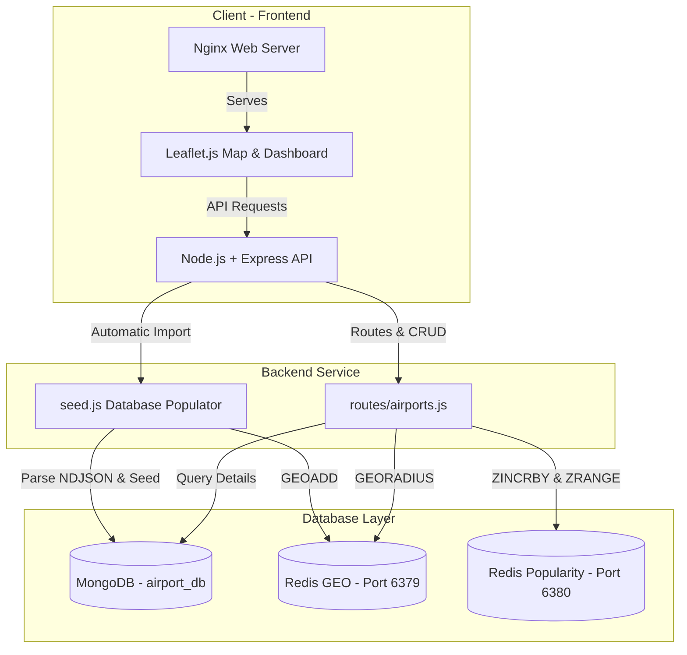

# ✈️ AeroPulse: Real-Time Geospatial Airport Analytics Platform

[](https://nodejs.org/)
[](https://www.mongodb.com/)
[](https://redis.io/)
[](https://www.docker.com/)
[](https://leafletjs.com/)

**AeroPulse** es una plataforma web reactiva y de alto rendimiento diseñada para la exploración geográfica y el análisis de popularidad de aeropuertos a nivel global en tiempo real. 

Este proyecto implementa una arquitectura híbrida de base de datos NoSQL y en caché distribuida combinando **MongoDB** (almacenamiento persistente), **Redis GEO** (cálculos de proximidad espacial ultrarrápidos) y **Redis Popularity** (analíticas y rankings de visitas en tiempo real). Todo el ecosistema está completamente contenedorizado y orquestado en **Docker** mediante un flujo de despliegue en un solo comando.

---

## 📸 Vista de la Plataforma (Dashboard)

El frontend está diseñado con una estética **Glassmorphism** premium en modo oscuro:
* **Mapa Interactivo Global**: Integración de Leaflet con cartografía oscura *CartoDB Dark Matter*.
* **Agrupamiento Inteligente (Marker Clustering)**: Agrupa miles de marcadores a nivel mundial dinámicamente sin degradar el rendimiento del navegador.
* **Proximity Search**: Haz doble clic en cualquier parte del mapa para dibujar un radio visual y listar los aeropuertos más cercanos con cálculos de distancia exactos.
* **Real-time Leaderboard**: Panel de popularidad dinámico que muestra el Top 10 de aeropuertos más visitados con barras de progreso animadas.
* **Operaciones CRUD en Caliente**: Formulario moderno para añadir nuevos aeropuertos, ventanas flotantes de edición y eliminación inmediata que sincroniza todas las bases de datos al instante.
* **Localización Dinámica**: Soporte nativo para traducción instantánea entre Inglés (EN) y Español (ES).

---

## 🏗️ Arquitectura del Sistema

El ecosistema está compuesto por 5 contenedores interconectados en una red bridge dedicada de Docker:



---

## ⚡ Características Clave & Detalles Técnicos

### 1. Motor de Sembrado Inteligente (Seeding)
Al iniciar la aplicación por primera vez, el backend analiza automáticamente `data_trasport.json` (NDJSON) convirtiéndolo dinámicamente en una colección MongoDB persistente. Al mismo tiempo, realiza una inserción masiva geoespacial en **Redis GEO** (`airports-geo`) optimizada a través de un **Redis Pipeline** para máxima velocidad.

### 2. Persistencia y Carga Especial (Aeroclub Larroque)
El cargador verifica e inserta de forma persistente y automática el **Aeroclub Larroque (LRQ)** en Entre Ríos, Argentina, posicionándolo geoespacialmente para búsquedas locales inmediatas sin requerir registros manuales.

### 3. TTL Dinámico en Popularidad
Cada clic en un marcador de aeropuerto realiza una consulta a la API REST que incrementa su puntaje de visitas con `ZINCRBY` en un ZSET en **Redis Popularity** (ejecutándose en un contenedor independiente en el puerto `6380`). El set completo posee un TTL de 24 horas (`EXPIRE` 86400 segundos) que se refresca en caliente con cada nueva consulta de perfil, manteniendo estadísticas móviles de popularidad diaria.

### 4. Sincronización CRUD en Caliente
Al crear, modificar o eliminar un aeropuerto mediante el panel de control del cliente:
* **Creación**: Se guarda en MongoDB y se agrega a Redis GEO con `GEOADD`.
* **Edición**: Se actualiza en MongoDB y se sincroniza su coordenada en Redis GEO.
* **Eliminación**: Se borra permanentemente de MongoDB, se remueve de Redis GEO con `ZREM` y se elimina del ranking de popularidad de Redis.

---

## 🛠️ API REST Endpoints

La API del backend Express está estructurada de forma inteligente evitando conflictos de parámetros dinámicos:

| Método | Endpoint | Descripción | Componente Base de Datos |
| :--- | :--- | :--- | :--- |
| **GET** | `/airports` | Devuelve la lista de todos los aeropuertos. | MongoDB |
| **GET** | `/airports/popular` | Obtiene el Top 10 de aeropuertos con más visitas, hidratados con datos de MongoDB. | Redis Popularity (ZSET) + MongoDB |
| **GET** | `/airports/nearby` | Busca aeropuertos en un radio de km desde una coordenada (`lat`, `lng`, `radius`). | Redis GEO (`GEORADIUS`) + MongoDB |
| **GET** | `/airports/:iata_code` | Obtiene los detalles de un aeropuerto, incrementa sus visitas (+1) y refresca el TTL. | MongoDB + Redis Popularity (`ZINCRBY` & `EXPIRE`) |
| **POST**| `/airports` | Crea un nuevo aeropuerto en MongoDB e indexa su posición en Redis GEO. | MongoDB + Redis GEO (`GEOADD`) |
| **PUT** | `/airports/:iata_code` | Actualiza un perfil e indexa sus nuevas coordenadas en Redis GEO. | MongoDB + Redis GEO (`GEOADD`) |
| **DELETE**| `/airports/:iata_code` | Elimina un aeropuerto del mapa, de MongoDB y de ambas instancias de Redis. | MongoDB + Redis GEO (`ZREM`) + Redis Pop (`ZREM`) |

---

## 🚀 Instrucciones de Ejecución

### Requisitos Previos
* Tener instalado **Docker** y **Docker Compose**.
* Disponer de los puertos `8080`, `3000`, `27017`, `6379` y `6380` libres.

### Despliegue en 1 comando
Clona este repositorio, navega a la carpeta del proyecto y ejecuta en tu terminal:

```bash
docker compose up --build -d
```

Este comando descargará las imágenes oficiales, compilará la API de Node.js y el servidor Nginx, levantará las redes y volúmenes, e iniciará el sembrado de datos en segundos.

### Verificación
* **Dashboard Web**: [http://localhost:8080](http://localhost:8080)
* **API Health Check**: [http://localhost:3000/health](http://localhost:3000/health)
* **API Popularity**: [http://localhost:3000/airports/popular](http://localhost:3000/airports/popular)

---

## 🔬 Tecnologías Utilizadas

* **Backend**: Node.js, Express, Mongoose (MongoDB ODM), ioredis (Redis Client).
* **Frontend**: HTML5, Vanilla CSS3 (Glassmorphism & Neon Design System), Leaflet.js, Leaflet.markercluster, FontAwesome 6, Google Fonts (Outfit).
* **Bases de Datos**: MongoDB 6.0, Redis 7.0 (GEO & Analytics).
* **Orquestación**: Docker, Docker Compose (Multi-container orchestration).
